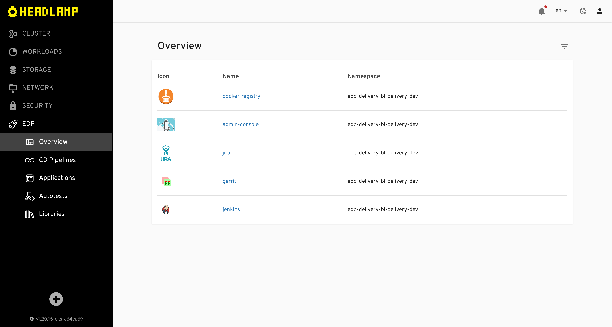
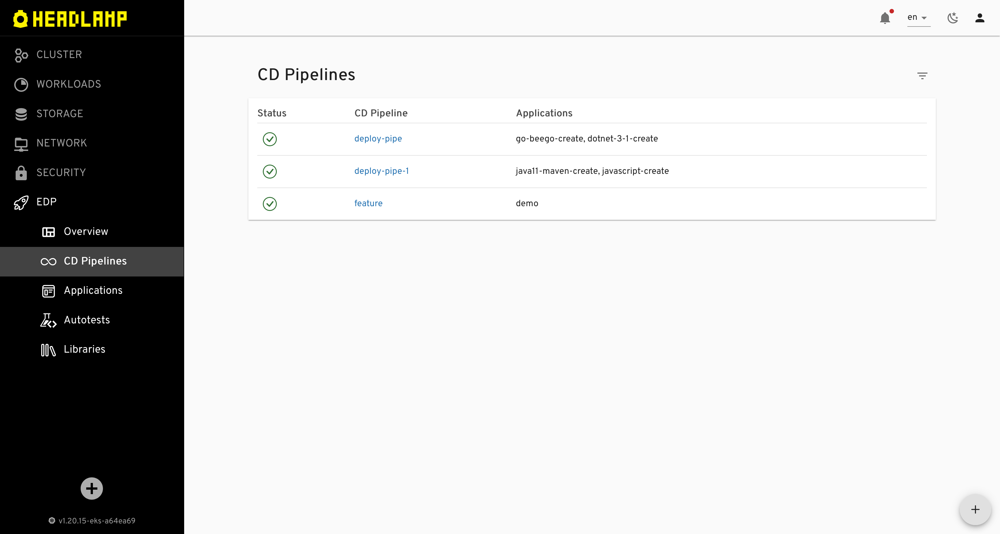
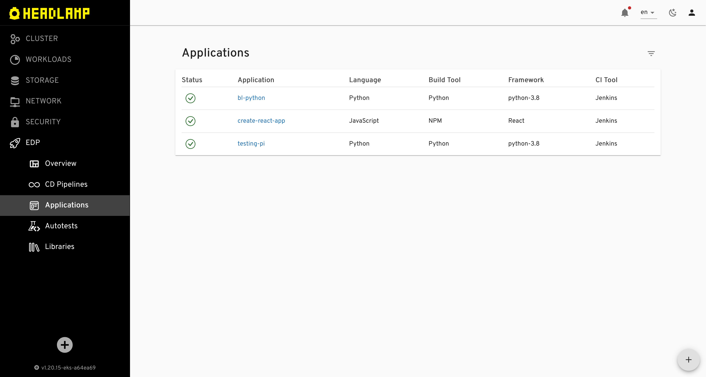

# EDP Admin Console v2.0

    <em>Central management tool in the EDP ecosystem. Powered by <a href="https://github.com/kinvolk/headlamp">Headlamp</a>.</em>
    

    
    

| :heavy_exclamation_mark: Please refer to [EDP documentation](https://epam.github.io/edp-install/) to get the notion of the main concepts and guidelines. |
| --- |

## Overview

EDP Admin Console v2.0 is new version of [EDP Admin Console](https://github.com/epam/edp-admin-console), build on top of [Headlamp](https://github.com/kinvolk/headlamp). All functionally specific to EDP written as plugins for a Headlamp.

https://user-images.githubusercontent.com/4813007/178267935-1a87d0dc-d015-4184-8109-d375030671d4.mp4

### Screenshots

<table>
    <tr>
        <td>
            
        </td>
    </tr>
    <tr>
        <td>
            
        </td>
        <td>
            
        </td>
    </tr>
</table>

## Local Development

### Requirements

* NodeJS LTS v16.16.0 or higher. [Install](https://nodejs.org)
* Headlamp Desktop App v0.10 or higher. [Install](https://kinvolk.github.io/headlamp/docs/latest/installation/desktop)
* make sure [environment variable `KUBECONFIG` is configured](https://kubernetes.io/docs/concepts/configuration/organize-cluster-access-kubeconfig)

### Start development locally

* run `npm run start`
* open Headlamp desktop application
