[](https://codecov.io/gh/epam/edp-headlamp)

# KubeRocketCI Portal

<p align="center">
    <em>Central management tool in the the KubeRocketCI (aka EDP) ecosystem. Powered by <a href="https://github.com/kinvolk/headlamp">Headlamp</a>.</em>
    <a href="https://github.com/kinvolk/headlamp"></a>
</p>
<p align="center">
    
    <a href="https://codecov.io/gh/epam/edp-headlamp"></a>
</p>

| :heavy_exclamation_mark: Please refer to [KubeRocketCI documentation](https://docs.kuberocketci.io) to get the notion of the main concepts and guidelines. |
| --- |

## Overview

KubeRocketCI Portal is  built on the top of [Headlamp](https://github.com/headlamp-k8s/headlamp). All the platform-specific functionality is written as Headlamp plugins.

https://github-production-user-asset-6210df.s3.amazonaws.com/42180137/285478565-df7f5393-233f-40f2-8acc-b8b0d90cb687.mp4

### Assets

<table>
    <tr>
        <td>
            
        </td>
    </tr>
    <tr>
        <td>
            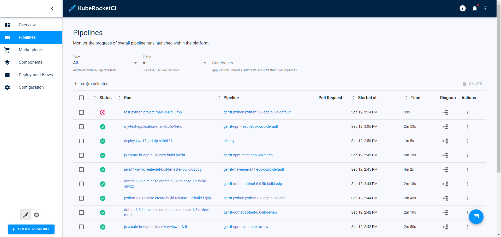
        </td>
    </tr>
    <tr>
        <td>
            
        </td>
    </tr>
    <tr>
        <td>
            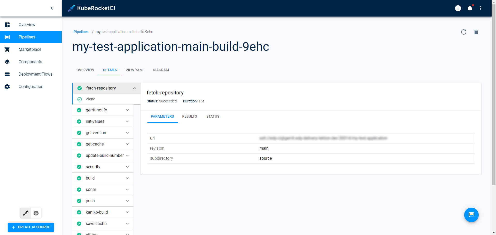
        </td>
    </tr>
    <tr>
        <td>
            
        </td>
    </tr>
    <tr>
        <td>
            
        </td>
    </tr>
    <tr>
        <td>
            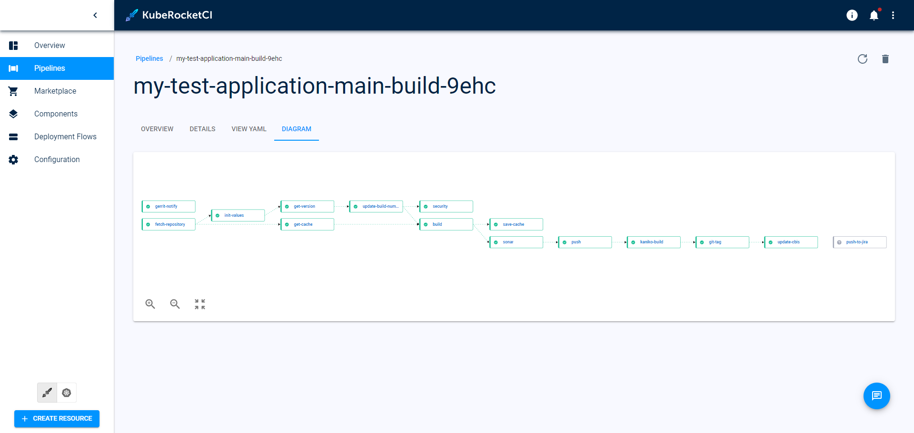
        </td>
    </tr>
    <tr>
        <td>
            
        </td>
    </tr>
    <tr>
        <td>
            
        </td>
    </tr>
    <tr>
        <td>
            
        </td>
    </tr>
    <tr>
        <td>
            
        </td>
    </tr>
    <tr>
        <td>
            
        </td>
    </tr>
    <tr>
        <td>
            
        </td>
    </tr>
    <tr>
        <td>
            
        </td>
    </tr>
    <tr>
        <td>
            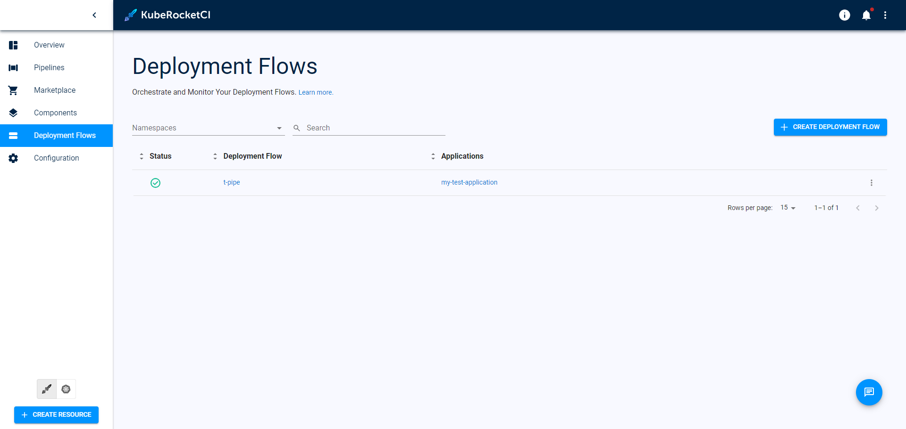
        </td>
    </tr>
    <tr>
        <td>
            
        </td>
    </tr>
    <tr>
        <td>
            
        </td>
    </tr>
    <tr>
        <td>
            
        </td>
    </tr>
    <tr>
        <td>
            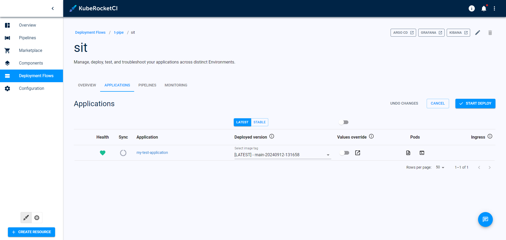
        </td>
    </tr>
    <tr>
        <td>
            
        </td>
    </tr>
    <tr>
        <td>
            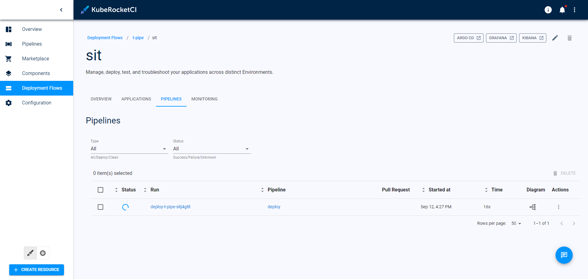
        </td>
    </tr>
    <tr>
        <td>
            
        </td>
    </tr>
    <tr>
        <td>
            
        </td>
    </tr>
    <tr>
        <td>
            
        </td>
    </tr>
    <tr>
        <td>
            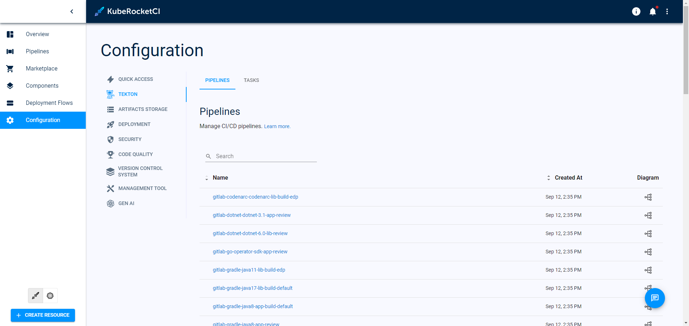
        </td>
    </tr>
    <tr>
        <td>
            
        </td>
    </tr>
    <tr>
        <td>
            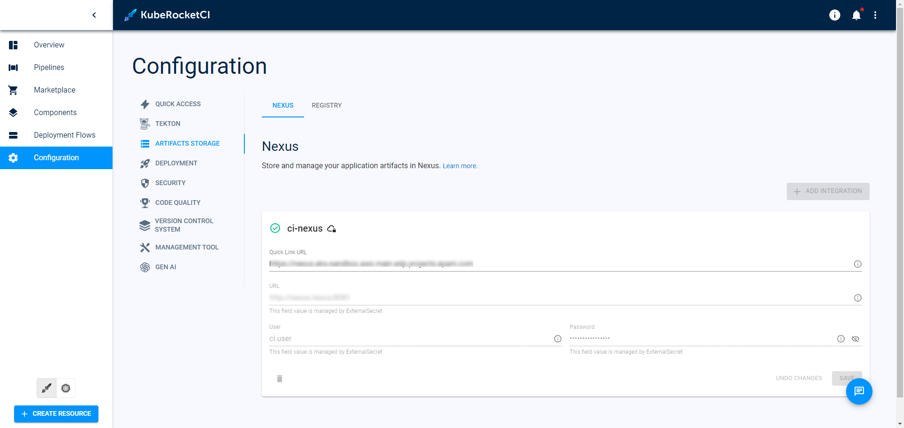
        </td>
    </tr>
    <tr>
        <td>
            
        </td>
    </tr>
    <tr>
        <td>
            
        </td>
    </tr>
    <tr>
        <td>
            
        </td>
    </tr>
    <tr>
        <td>
            
        </td>
    </tr>
    <tr>
        <td>
            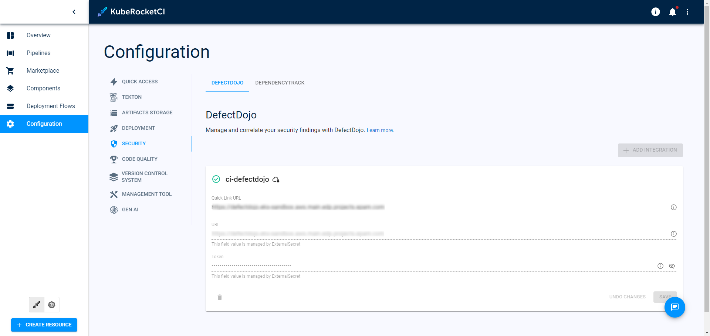
        </td>
    </tr>
    <tr>
        <td>
            
        </td>
    </tr>
    <tr>
        <td>
            
        </td>
    </tr>
    <tr>
        <td>
            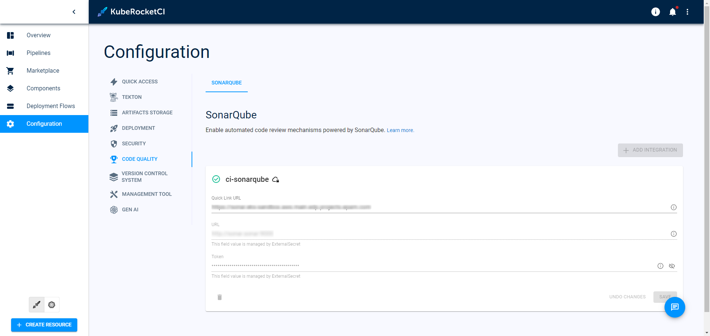
        </td>
    </tr>
    <tr>
        <td>
            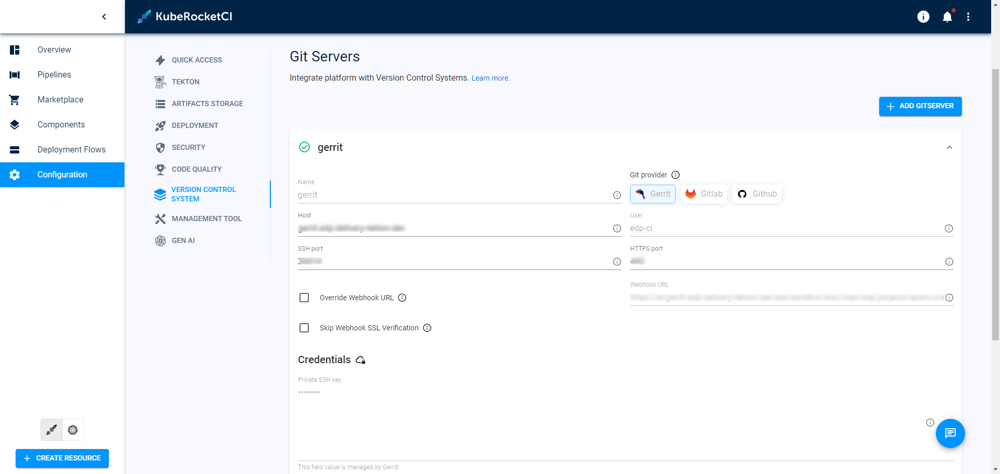
        </td>
    </tr>
    <tr>
        <td>
            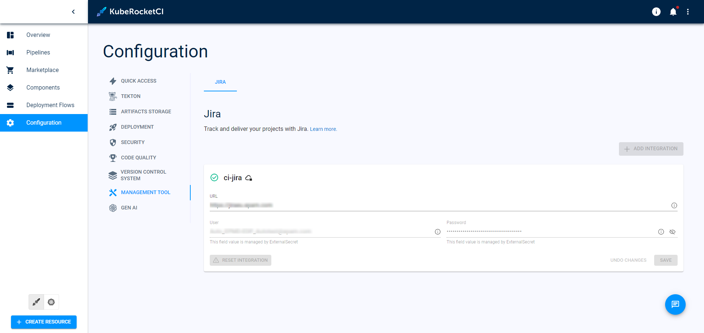
        </td>
    </tr>
    <tr>
        <td>
            
        </td>
    </tr>
    <tr>
        <td>
            
        </td>
    </tr>
    <tr>
        <td>
            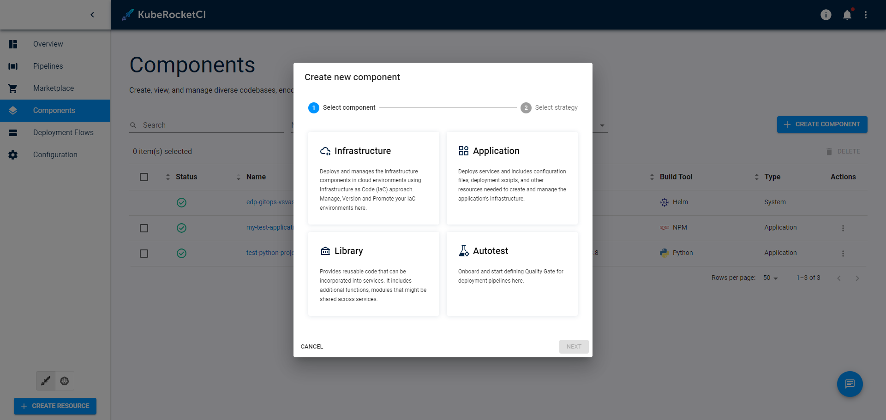
        </td>
    </tr>
    <tr>
        <td>
            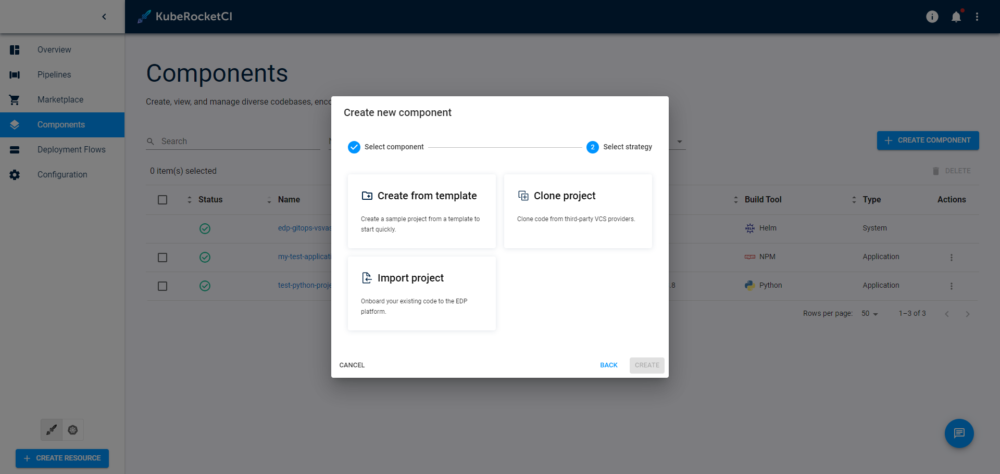
        </td>
    </tr>
    <tr>
        <td>
            
        </td>
    </tr>
    <tr>
        <td>
            
        </td>
    </tr>
    <tr>
        <td>
            
        </td>
    </tr>
    <tr>
        <td>
            
        </td>
    </tr>
    <tr>
        <td>
            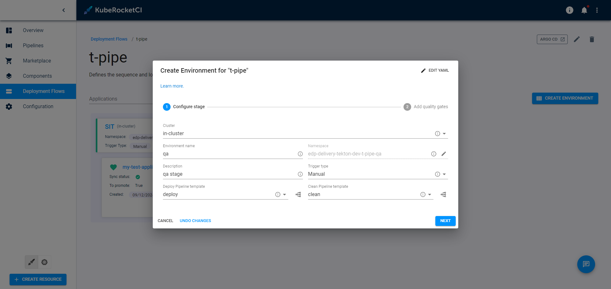
        </td>
    </tr>
    <tr>
        <td>
            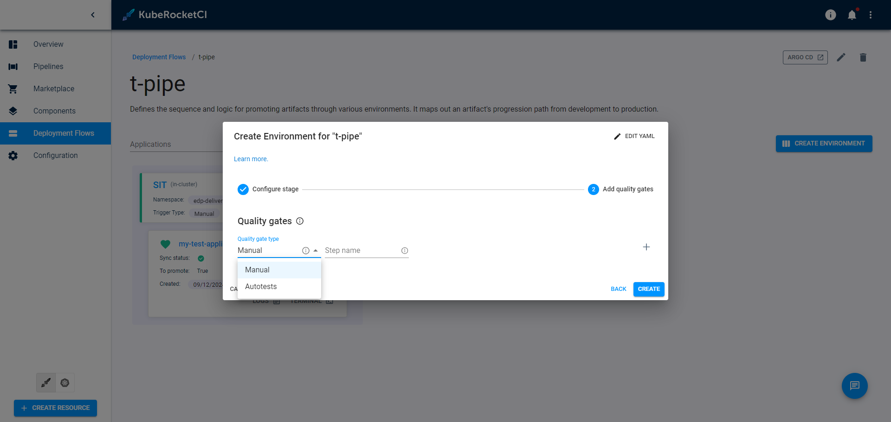
        </td>
    </tr>
</table>

## Installation

In order to install the KubeRocketCI Headlamp, follow the steps below:

1. To add the Helm EPAMEDP Charts for local client, run "helm repo add":

     ```bash
     helm repo add epamedp https://epam.github.io/edp-helm-charts/stable
     ```

2. Choose available Helm chart version:

     ```bash
     helm search repo epamedp/edp-headlamp -l
     ```

   Example response:

     ```bash
     NAME                	            CHART VERSION	APP VERSION	    DESCRIPTION
     epamedp/edp-headlamp	            0.15.0        	0.15.0      	A Helm chart for KubeRocketCI Headlamp
     ```

    _**NOTE:** It is highly recommended to use the latest released version._

3. Full chart parameters available in [deploy-templates/README.md](deploy-templates/README.md).

4. Install edp-headlamp in the <edp-project> namespace with the helm command; find below the installation command example:

    ```bash
    helm install edp-headlamp epamedp/edp-headlamp --namespace <edp-project> --version <chart_version> --set name=edp-headlamp --set global.platform=<platform_type>
    ```

5. Check the <edp-project> namespace that should contain edp-headlamp deployment in a running status.

## Local Development

Development versions are also available, please refer to the [snapshot Helm Chart repository](https://epam.github.io/edp-helm-charts/snapshot/) page.

### Requirements

* [NodeJS LTS v16.16.0](https://nodejs.org) or higher.
* [Headlamp Desktop App v0.10](https://kinvolk.github.io/headlamp/docs/latest/installation/desktop) or higher.
* [`KUBECONFIG` environment variable](https://kubernetes.io/docs/concepts/configuration/organize-cluster-access-kubeconfig) is configured.

### Start Local Development

* Run the `npm run start` command.
* Open the Headlamp desktop application.
