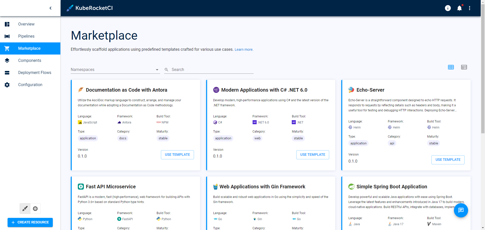
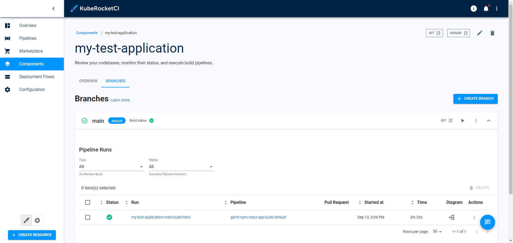

# All Assets

## Pipelines

## Pipeline Overview

## Pipeline Details

## Pipeline Diagram

## Marketplace

## Components

## Deployment Flows

## Environment Overview

## Environment Applications

## Environment Pipelines

## Environment Monitoring

## Links

## Tekton Pipelines

## Nexus

## Registry

## Clusters

## GitOps

## Argo CD

## DefectDojo

## DependencyTrack

## SonarQube

## GitServers

## Jira

## Headlamp Features

## Application Create

## Deployment Flow Create

## Environment Create

